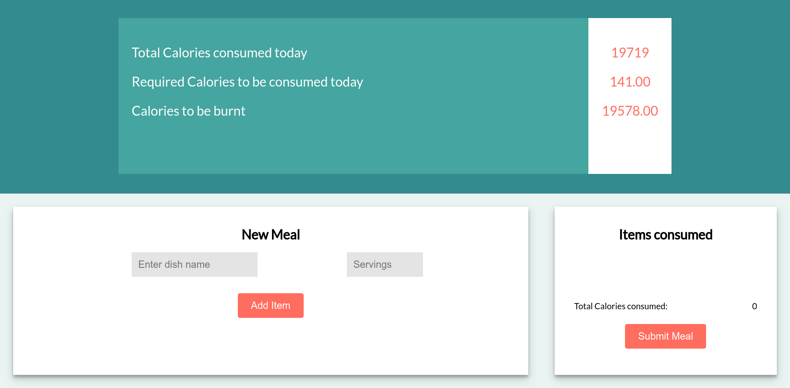

# FitEat
## About The Website
   User friendly health and fitness website that tracks calories intake and evaluates accordingly.
   - Easily accessible
   - Platform independent
## Features
1. The user can add the details of height, weight, age, goal weight , goal duration and exercise intensity to determine the number of calories required to be consumed per day. 
2. This data is stored in the MongoDB database and the total number of calories gets updated after each meal whose value is fetched from the database.
3. Model View Controller ( MVC design ) has been implemented.
4. Data is fetched using the Javascript Fetch API from the backend.
5. Calorie and food data is fetched from a third party API ( https://www.nutritionix.com/business/api ).
6. This data returns the number of calories for each meal item which adds on to the total calories after the user submits the meal. These values get stored in the database.
## Technology used
1. Frontend -
 a. HTML5
 b. CSS3
 c. Javascript
2. Backend -
a. Node.js
b. Express.js
c. MongoDB
## Features that can be added on
1. Authentication wtih User Logout and Login system.
2. Update and Delete functionalities for meals.
3. History for Meal data.

## Component Hierarchy
### Landing Page
### User input form to evaluate results
### Calories consumed and required calories
### Add meal 
### Items consumed and Submit Meal

## Live demo
_ (https://fiteat-app.herokuapp.com/) _
## Screenshots




# How to Contribute to this repository 

1. Fork this repo
2. Clone the repo using ``` git clone <repo-link> ```
3. Make a new branch using ``` git checkout -b <branch-name> ```
4. After making changes, add your files using ``` git add . ```
5. Commit your files for push using ``` git commit -m "commit-message" ```
6. Push these changes to your fork using ``` git push origin <branch-name> ```
7. Create a pull request to the main repo.

## Things to keep in mind before submitting a PR:

1. Make sure your branches are up to date with the master branch of the main repo.
2. Add the upstream repo by using ``` git remote add upstream <upstream-repo-link> ```
3. Fetch the latest commit details using ``` git fetch upstream ``` and merge them using ``` git merge upstream/master master ```
